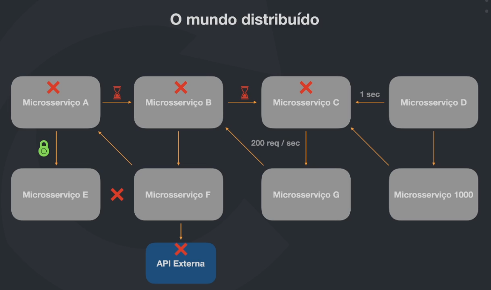
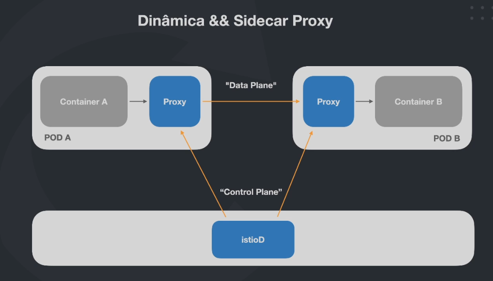
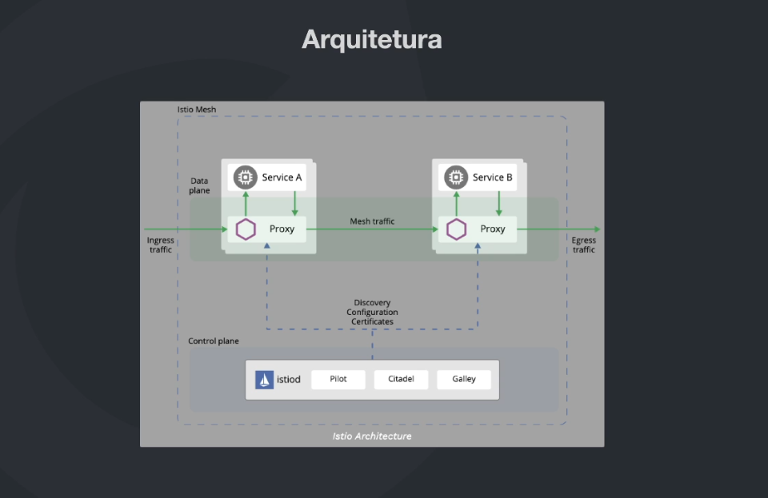
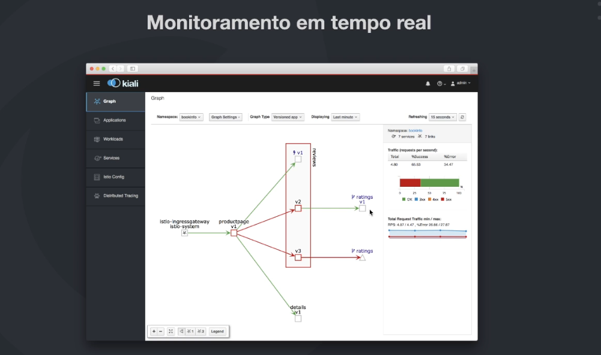

# Istio



## Benefícios do Istio

1. Gerenciamento de tráfego

    - Gateways (entrada e saída)
    - Load Balancing
    - Timeout
    - Política de Retry
    - Circuit Breaker
    - Fault Injection

2. Observabilidade

    - Métricas
    - Traces distribuídos
    - Logs

3. Segurança

    - Man-in-the-middle
    - mTLS
    - AAA (authentication, autorization e audit)





-   Pilot: Controla todos os formatos de configurações;
-   Citadel: Trabalha com a parte de autenticação;
-   Galley: Traduz o que se faz para linguagem do Istio.



## Instalação do k3d

O k3d proprociona um bind de portas mais simples de ser configurado.

Documentação: https://k3d.io

```bash
wget -q -O - https://raw.githubusercontent.com/k3d-io/k3d/main/install.sh | bash
```

## Criação do cluster e configuração do contexto

```bash
# --agents 2: são os nodes
k3d cluster create -p "8000:30000@loadbalancer" --agents 2

# Configuração do contexto
kubectl config use-context k3d-k3s-default
# Mensagem esperada: Switched to context "k3d-k3s-default".
```

## Instalação do Istio

Documentação: https://istio.io/latest/docs/setup/getting-started/#download

```bash
# Baixa
curl -L https://istio.io/downloadIstio | sh -

# Move para pasta de /opt
sudo mv istio-1.18.2 /opt

# Configura a variável de ambiente
nano ~/.zshrc
export PATH="$PATH:/opt/istio-1.18.2/bin"
source ~/.zshrc

# Testa
istioctl
```
